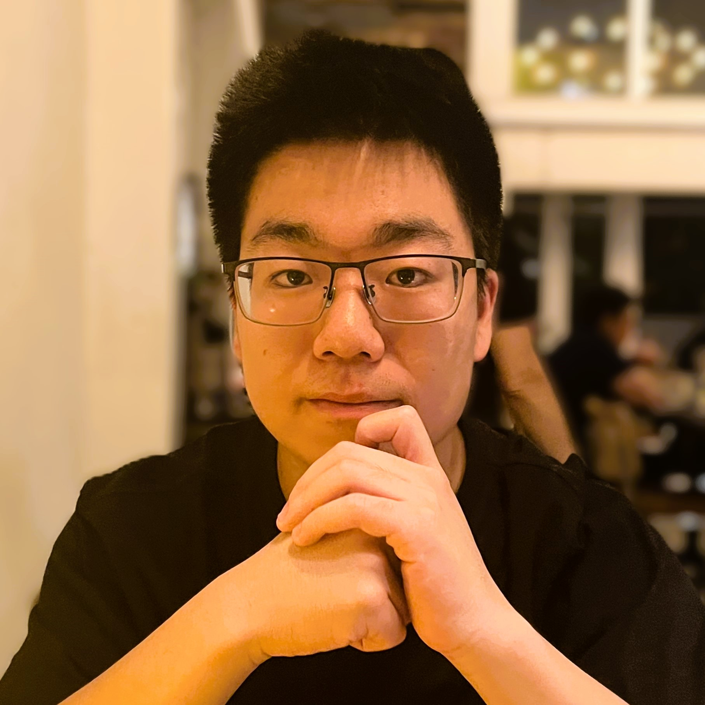

> Seeking 2025 SDE/SWE/Digital Intern Roles : **[LinkedIN](https://www.linkedin.com/in/shan-jiang-022050235/)!**

 
    

 <b>Shan Jiang</b>   <em>Graduate Student</em> 

 <a href="https://oden.utexas.edu" target="blank">Oden Institute for Computational Engineering and Sciences</a> 
<a href="https://utexas.edu" target="blank">The University of Texas at Austin</a>

 <a href="files/Shan_Jiang_intern_Resume.pdf">Resume </a> 

 

I obtained my B.S. in Mathematics of Computation from [University of California, Los Angeles](https://www.ucla.edu/) in June 2024. During my undergraduate studies, I conducted summer research under the supervision of Prof. Xianyi Zeng from Lehigh University.

From June 2024 to August 2024, I worked at [Howen Technologies](https://www.howentech.com/) as an Embedded Software Engineer, where we developed products including Mobile Digital Video Recorders and Mobile Data Terminals with Artificial Intelligence functions.

Currently, I am pursuing my Master's degree in Computational Science, Engineering, and Mathematics at [UT Austin](https://www.utexas.edu/), with research interests in high-performance computing, optimization, and algorithms.

