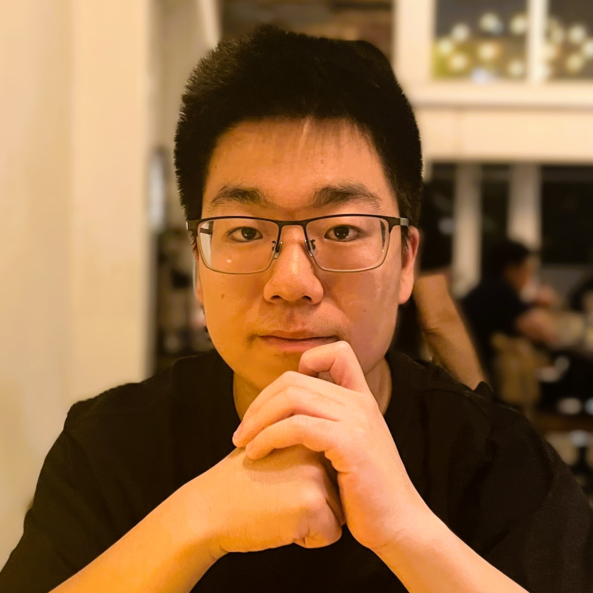

> Seeking 2026 New Grad SDE/MLE Roles : **[LinkedIn](https://www.linkedin.com/in/shan-jiang-022050235/)**

 
    

 <b>Shan Jiang</b>   <em>Graduate Student</em> 

 <a href="https://oden.utexas.edu" target="blank">Oden Institute for Computational Engineering and Sciences</a> 
<a href="https://utexas.edu" target="blank">The University of Texas at Austin</a>

 

I am currently a Master’s student in Computational Science, Engineering, and Mathematics at  [UT Austin](https://www.utexas.edu/), advised by Prof. George Biros. My research focuses on phase-field modeling and neural networks for physical simulation and scientific computing.

In Fall 2025, I worked as an [LCCF intern](https://tacc.utexas.edu/about/internships/lccf/) with the Evaluation Services Team at the [Texas Advanced Computing Center](https://tacc.utexas.edu/) (TACC), focusing on AI agents for automated survey analysis and educational research. You can find more information about our cohort in this [LinkedIn post](https://www.linkedin.com/posts/texas-advanced-computing-center-tacc_welcome-cohort-4-through-the-us-national-activity-7386409551442472960-2tSC?utm_source=share&utm_medium=member_desktop&rcm=ACoAADqPpRoBV1fecjqZhbEEiIpeDuIJDtjdtfM).

I obtained my B.S. in Mathematics of Computation, graduating *cum laude*, from [University of California, Los Angeles](https://www.ucla.edu/) in June 2024. 

In Summer 2025, I was a research intern at Baidu, where I worked in the deep learning framework group, widely known as [PaddlePaddle](https://www.paddlepaddle.org.cn/en).

