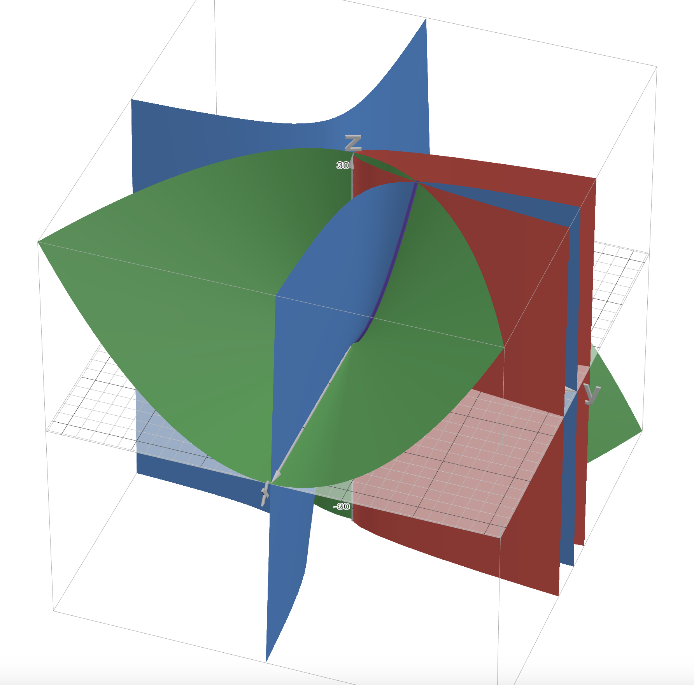
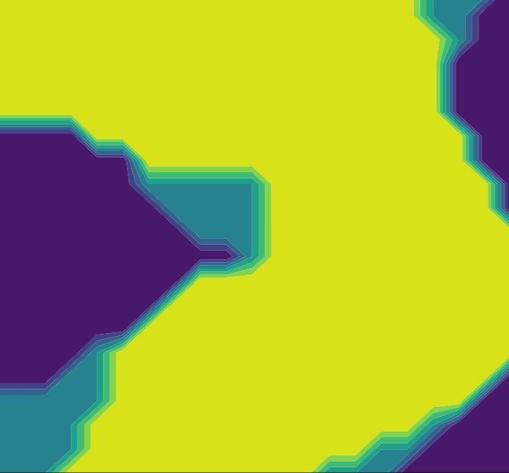

# Course Projects

<!-- Project 1 -->

  
 
    
  

  

    
<strong>Project 1: Learning Algebraic Variety through Optimization</strong>

    
In this project, we applied numerical linear algebra techniques on a multivariate Vandermonde matrix to identify the generator of the vanishing ideal, successfully reconstructing the true algebraic variety on which the data points lie. Additionally, we designed and implemented the iterative optimization algorithm, focusing on Sequential Quadratic Programming, to accurately determine vanishing polynomials, even in the presence of noisy data. <a href="https://github.com/273A-project/273A-Project">Project page.</a> 

  

<!-- Project 2 -->

  
 
    
  

  

    
<strong>Project 2: Reinforcement Learning with Mountain Car Game</strong>

    
In a group of four, we take a deep-dive into RL learning applied to a simple mountain car game with low-dimensional action and state spaces. We utilize this environment to study the effects of various state-of-the-art RL methods, explore the best parameters utilizing an epsilon-greedy policy scheme, and compare the results through graphical visualizations. <a href="https://github.com/oscaro00/Math156_Project">Project page.</a>

  

