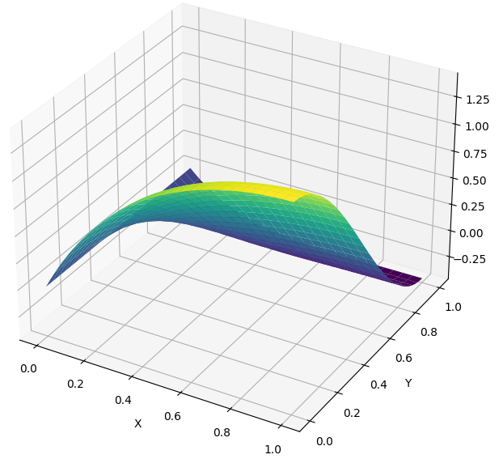
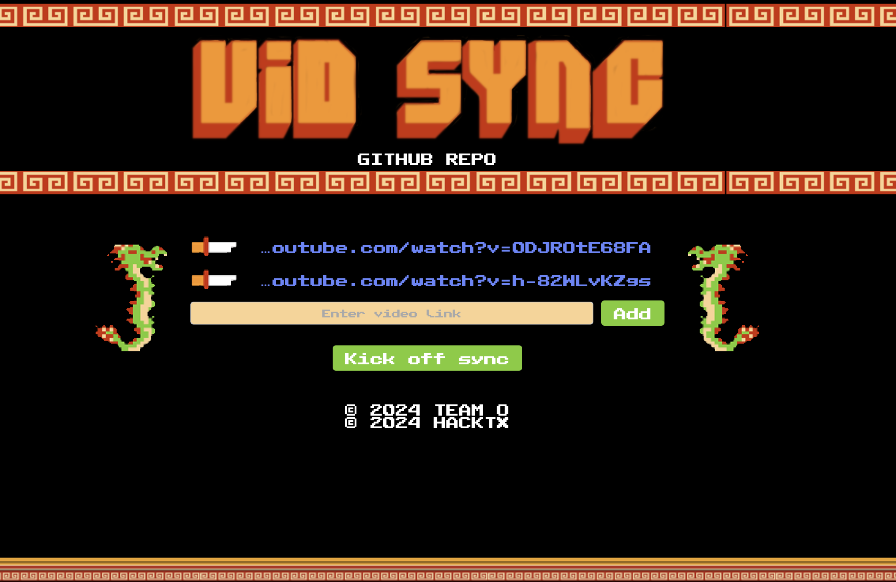
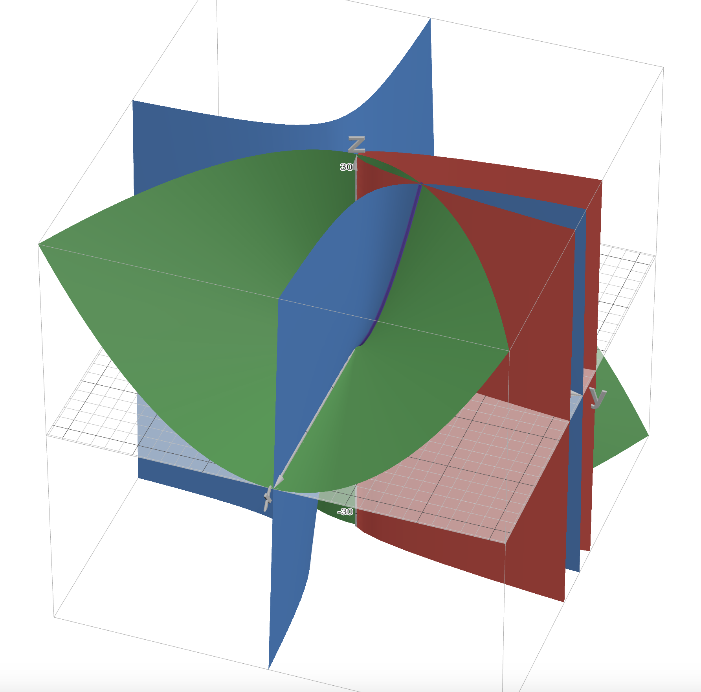
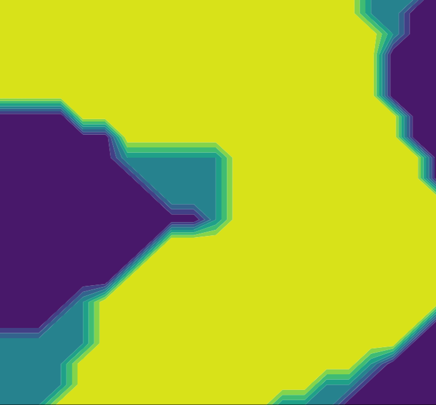

# Notable Projects
<!-- Project 1 -->

  
 
    
  

  

    
<strong>Project 1: Finite Element Solver for Poisson Equation over 2D Domain</strong>

    
Key steps of this project include mesh generation, stiffness matrix assembly, and result validation through error analysis and convergence testing. The project demonstrates the expected theoretical convergence rates, confirming the accuracy of the implementation. We used a Boost-based test-suite for unit and regression testing, Valgrind for verifying memory safety and detecting potential leaks, and Docker for containerization. <a href="https://drive.google.com/file/d/1eZzuyFJ_aDWSCTdNZQfBNF4hQQj6d8Yw/view?usp=sharing">Project document.</a> 

  

  
 
    
  

  

    
<strong>Project 2: Vid Sync: A Simple YouTube Multi-Video Playback Syncing Tool</strong>

    
We present a solution that eliminates the need for manual alignment by using the audio data to obtain a set of time offsets of YouTube URLs and generating a link to open the ViewSync player. This was achieved by building a full-stack web application using Flask, HTML, CSS, and JavaScript. The app processes audio to precisely align multiple video streams, eliminating the need for manual adjustments and ensuring smooth synchronization. <a href="https://github.com/ghbrown/vid-sync">Project page.</a> 

  

<!-- Project 2 -->

  
 
    
  

  

    
<strong>Project 3: Learning Algebraic Variety through Optimization</strong>

    
In this project, we applied numerical linear algebra techniques on a multivariate Vandermonde matrix to identify the generator of the vanishing ideal, successfully reconstructing the true algebraic variety on which the data points lie. Additionally, we designed and implemented the iterative optimization algorithm, focusing on Sequential Quadratic Programming, to accurately determine vanishing polynomials, even in the presence of noisy data. <a href="https://github.com/273A-project/273A-Project">Project page.</a> 

  

<!-- Project 3 -->

  
 
    
  

  

    
<strong>Project 4: Reinforcement Learning with Mountain Car Game</strong>

    
In a group of four, we take a deep-dive into RL learning applied to a simple mountain car game with low-dimensional action and state spaces. We utilize this environment to study the effects of various state-of-the-art RL methods, explore the best parameters utilizing an epsilon-greedy policy scheme, and compare the results through graphical visualizations. <a href="https://github.com/oscaro00/Math156_Project">Project page.</a>

  

