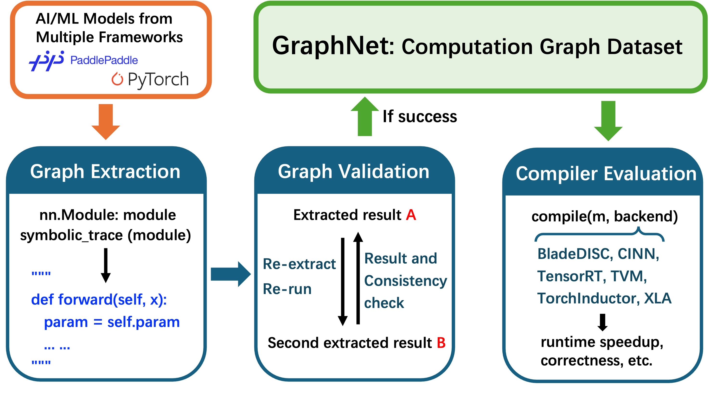

  

    
  

  

    
<strong>GraphNet: A Large-Scale Computational Graph Dataset for Tensor Compiler Research</strong> 
    <a href="https://github.com/PaddlePaddle/GraphNet">[GitHub]</a> · 
    <a href="https://github.com/PaddlePaddle/GraphNet/blob/develop/GraphNet_technical_report.pdf">[Preprint]</a>
    

    In Summer 2025, I collaborated with <a href="https://github.com/lixinqi" target="_blank">Xinqi Li</a> at Baidu to initiate the GraphNet project — a dataset of 2.7K real-world deep learning computational graphs with rich metadata spanning six major task categories across multiple frameworks. To evaluate compiler performance on these samples, we proposed the benchmark metrics <em>Speedup Score</em> and <em>Error-aware Speedup Score</em>, which jointly assess runtime efficiency and correctness under tunable tolerance levels, enabling robust analysis and optimization of tensor compilers such as TorchInductor and CINN.
    

  

